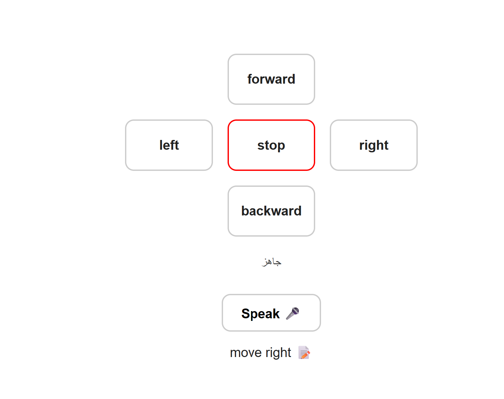

# 🤖 Voice-Controlled Robot

A web-based robot control interface that allows users to control robot movements using buttons and voice commands. The project also stores recognized voice commands in a MySQL database using PHP.

## 🌐 Live Website

🔗 https://ath.free.je/a/

## 📸 Project Preview



## 📌 Project Description

This project provides a web-based control panel for a robot with two methods of control:

- 🎮 Manual control using directional buttons
- 🎤 Voice control using speech recognition

Users can control the robot using commands such as `forward`, `backward`, `left`, `right`, and `stop`.

Voice commands are converted from speech to text using the browser's **Web Speech API** and then sent to the PHP backend. The recognized commands are stored in a MySQL database.

## ✨ Features

- 🎮 Robot movement control using buttons
- 🎤 Voice command recognition
- 📝 Speech-to-text conversion
- 🌐 Web-based control interface
- 🐘 PHP backend integration
- 🗄️ MySQL database integration
- 💾 Voice command storage
- ⚡ Communication between the web interface and backend

## 🛠️ Technologies Used

- HTML
- CSS
- JavaScript
- Web Speech API
- PHP
- MySQL
- XAMPP
- phpMyAdmin

## 🎮 Robot Commands

| Control | Command |
|---|---|
| ⬆️ Forward | `forward` |
| ⬅️ Left | `left` |
| ⏹️ Stop | `stop` |
| ➡️ Right | `right` |
| ⬇️ Backward | `backward` |

## 🎤 Voice Control

The project uses the browser's **Web Speech API** to recognize spoken commands.

The process works as follows:

```text
🎤 Voice Command
      ↓
📝 Speech-to-Text
      ↓
🌐 Web Interface
      ↓
🐘 save_voice.php
      ↓
🗄️ MySQL Database

For example:

User says: "move right"
        ↓
Speech is converted to text
        ↓
Text is sent to save_voice.php
        ↓
Command is stored in the voice_commands table
🗄️ Database

The project uses MySQL to store recognized voice commands.

voice_commands Table
Field	Description
id	Unique command ID
text	Recognized voice command
created_at	Date and time of the command
📂 Project Files
voice-controlled-robot/
│
├── index.html
├── save_voice.php
├── update_command.php
├── get_state.php
├── db.php
├── setup.sql
└── photo.png
🚀 How to Run
1. Install XAMPP

Start the following services:

Apache
MySQL
2. Add the Project

Place the project folder inside:

xampp/htdocs/
3. Set Up the Database

Open phpMyAdmin and import:

setup.sql

This creates the required database tables.

4. Open the Website

Open the project through the local XAMPP server.

5. Test the Controls

Use the control buttons to send robot movement commands.

For voice control, click:

🎤 Speak

Then say a command such as:

move right

The recognized speech will appear on the webpage and will be sent to the PHP backend and stored in the MySQL database.

🎯 Project Goal

The goal of this project is to develop an interactive web interface for robot control and demonstrate the integration of:

Web Development + Speech Recognition + PHP + MySQL + Robot Control

👩🏻‍💻 Project

This project demonstrates the integration of Artificial Intelligence and Web Development by using speech recognition to convert voice commands into text and control a robot through a web-based interface.
